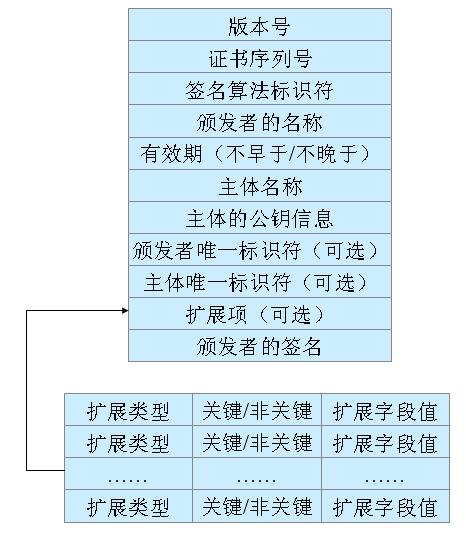
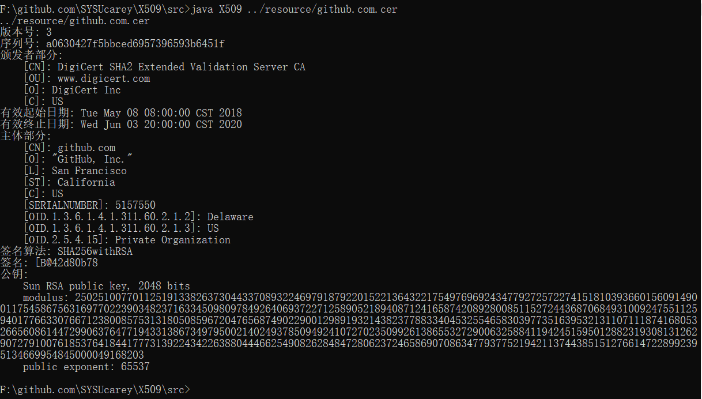

# X509证书读取与解析实验报告
## （2018年秋季学期）
| 课程名称 | Web安全技术 |   任课老师   |      蔡国扬      |
| :------: | :---------: | :----------: | :--------------: |
|   年级   |    大三     | 专业（方向） |       计应       |
|   学号   |  16340015   |     姓名     |      陈彬彬      |
|   电话   | 13590883387 |    Email     | 944131226@qq.com |
| 开始日期 | 2018/12/15  |   完成日期   |    2018/12/16    |

---

## 一、X509证书结构描述

### 1.1 X509证书类型

X.509证书有多种常用的文件扩展名，代表着不同形式的数据编码以及内容

其中常见的有（来自 [Wikipedia](https://zh.wikipedia.org/wiki/X.509) ）：

- `.pem` 

  **隐私增强型电子邮件** ，DER编码的证书再进行Base64编码的数据存放在"-----BEGIN CERTIFICATE-----"和"-----END CERTIFICATE-----"之中。

- `.cer`, `.crt`, `.der` – 通常是DER二进制格式的，但Base64编码后也很常见。

- `.p7b`, `.p7c` – PKCS#7 SignedData structure without data, just certificate(s) or CRL(s)

- `.p12` – PKCS#12格式，包含证书的同时可能还有带密码保护的私钥

- `.pfx` – PFX，PKCS#12之前的格式（通常用PKCS#12格式，比如那些由IIS产生的PFX文件）

***

### 1.2 X509证书的结构

**整体数据结构如下图所示：** 



#### 1.2.1 X509证书基本部分 

- 版本号：

  标识证书的版本（版本1、版本2或是版本3）

- 序列号：

  标识证书的唯一整数，由证书颁发者分配的本证书的唯一标识符

- 签名算法：

  用于签证书的算法标识，由对象标识符加上相关的参数组成，用于说明本证书所用的数字签名算法

- 颁发者：

  证书颁发者的可识别名（DN）

- 证书有效期 ：

  证书有效期的时间段。本字段由”Not Before”和”Not After”两项组成，意义为：此日期前无效 - 此日期后无效。它们分别由UTC时间或一般的时间表示（在RFC2459中有详细的时间表示规则）。

- 主体：

  证书拥有者的可识别名，这个字段必须是非空的，除非你在证书扩展中有别名。 

- 主体公钥信息 

  - 公钥算法
  - 主体公钥

- 颁发者唯一标识符（可选项）

  标识符—证书颁发者的唯一标识符，仅在版本2和版本3中有要求，属于可选项。 

- 主体唯一身份信息（可选项）

  证书拥有者的唯一标识符，仅在版本2和版本3中有要求，属于可选项。 

#### 1.2.2 X509证书拓展部分

- 发行者密钥标识符
- 密钥使用
- CRL分布点
- 私钥的使用期
- 证书策略
- 策略映射
- 主体别名
- 颁发者别名
- 主体目录属性

------

## 二、数据结构

这次我们主要进行解析的是X509证书的基本部分。包括版本号、序列号、颁发者详情、证书有效期、证书主体、签名算法、签名信息和公钥。

利用`FileInputStream` 读取文件流，

然后使用 `java.security` 的库对文件流进行解析，生成证书。

```java
import java.security.*;
import java.io.*;
import java.security.cert.*;
import java.security.cert.Certificate;
CertificateFactory cf;
// 获取工厂实例
CertificateFactory cf = CertificateFactory.getInstance("X.509");
// 用文件流读入证书
FileInputStream fis = new FileInputStream(fileLocation);
// 生成证书
Certificate c = cf.generateCertificate(fis);
X509Certificate t = (X509Certificate)c;
fis.close();
```

解析证书后，获取库中 `X509Certificate` 类的关键成员信息，其中包括版本号、序列号、颁发者详情、证书有效期、证书主体、签名算法、签名信息和公钥等，然后在终端上输出结果。

```java
System.out.println("版本号: " + t.getVersion());
System.out.println("序列号: " + t.getSerialNumber().toString(16));
System.out.println("颁发者部分: ");
String issuerDN = t.getIssuerDN().toString();
String[] issuerInfo = issuerDN.split(",");
judge = false;
for(int i  = 0; i < issuerInfo.length; i++) {
    if(issuerInfo[i].contains("\"")) {
        if(judge) System.out.println("," + issuerInfo[i]);
        else {
            int index = issuerInfo[i].indexOf("=");
            String key = issuerInfo[i].substring(0, index).replaceAll(" ", "");
            String value = issuerInfo[i].substring(index+1);
            System.out.print("    [" + key + "]: " + value);
        }
        judge = !judge;
        continue;
    }
    int index = issuerInfo[i].indexOf("=");
    String key = issuerInfo[i].substring(0, index).replaceAll(" ", "");
    String value = issuerInfo[i].substring(index+1);
    System.out.println("    [" + key + "]: " + value);
}
System.out.println("有效起始日期: " + t.getNotBefore());
System.out.println("有效终止日期: " + t.getNotAfter());
System.out.println("主体部分: ");
String[] subjectInfo = t.getSubjectDN().toString().split(",");
judge =false;
for(int i  = 0; i < subjectInfo.length; i++) {
    if(subjectInfo[i].contains("\"")) {
        if(judge) System.out.println("," + subjectInfo[i]);
        else {
            int index = subjectInfo[i].indexOf("=");
            String key = subjectInfo[i].substring(0, index).replaceAll(" ", "");
            String value = subjectInfo[i].substring(index+1);
            System.out.print("    [" + key + "]: " + value);
        }
        judge = !judge;
        continue;
    }
    int index = subjectInfo[i].indexOf("=");
    String key = subjectInfo[i].substring(0, index).replaceAll(" ", "");
    String value = subjectInfo[i].substring(index+1);
    System.out.println("    [" + key + "]: " + value);
}
System.out.println("签名算法: " + t.getSigAlgName());
System.out.println("签名: " + t.getSignature().toString());
System.out.println("公钥: ");
PublicKey pk = t.getPublicKey();
String pkStr = pk.toString();
String[] pkInfo = pkStr.split("\n");
for(int i = 0; i < pkInfo.length; i++) 
    System.out.println("    " + pkInfo[i].trim());
```

------

## 三、java语言源代码

- 源码已经在上传作业包下的 **src** 文件夹内
- 或者查看 [我的github项目](https://github.com/SYSUcarey/X509) 

------

## 四、编译运行结果

运行环境：Win 10

示例：`github.com.cer`

```bash
$ javac X509.java
$ java X509 ../resource/github.com.cer
../resource/github.com.cer
版本号: 3
序列号: a0630427f5bbced6957396593b6451f
颁发者部分:
    [CN]: DigiCert SHA2 Extended Validation Server CA
    [OU]: www.digicert.com
    [O]: DigiCert Inc
    [C]: US
有效起始日期: Tue May 08 08:00:00 CST 2018
有效终止日期: Wed Jun 03 20:00:00 CST 2020
主体部分:
    [CN]: github.com
    [O]: "GitHub, Inc."
    [L]: San Francisco
    [ST]: California
    [C]: US
    [SERIALNUMBER]: 5157550
    [OID.1.3.6.1.4.1.311.60.2.1.2]: Delaware
    [OID.1.3.6.1.4.1.311.60.2.1.3]: US
    [OID.2.5.4.15]: Private Organization
签名算法: SHA256withRSA
签名: [B@42d80b78
公钥:
    Sun RSA public key, 2048 bits
    modulus: 25025100770112519133826373044337089322469791879220152213643221754976969243477927257227415181039366015609149001175458675631697702239034823716334509809784926406937227125890521894087124165874208928008511527244368706849310092475511259401776633076671238008575313180508596720476568749022900129891932143823778833404532554658303977351639532131107111874168053266560861447299063764771943313867349795002140249378509492410727023509926138655327290063258841194245159501288231930813126290727910076185376418441777313922434226388044466254908262848472806237246586907086347793775219421137443851512766147228992395134669954845000049168203
    public exponent: 65537
```

截图结果：




其余证书实验截图：

- **google.com.cer** 


- **microsoft.com.cer** 


- **csdn.net.cer** 


- **baidu.com.cer** 


